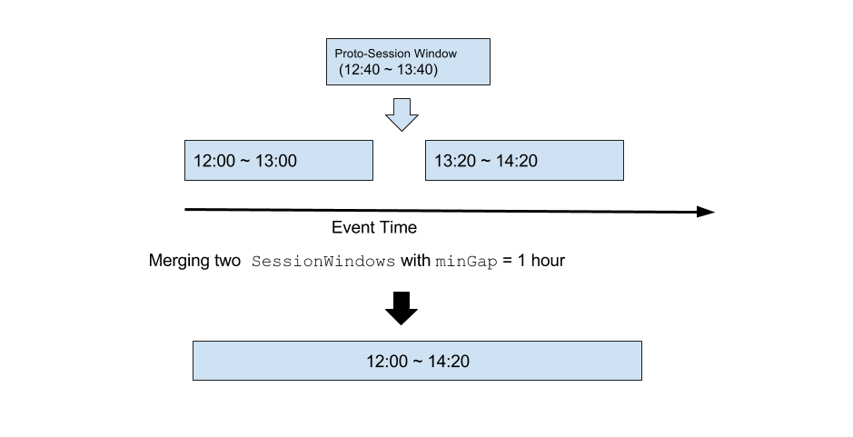
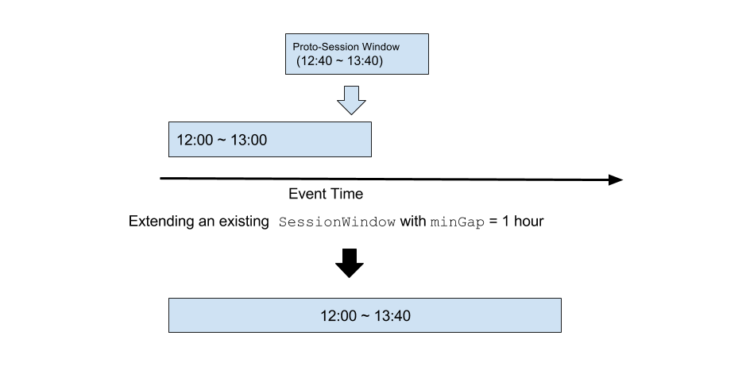
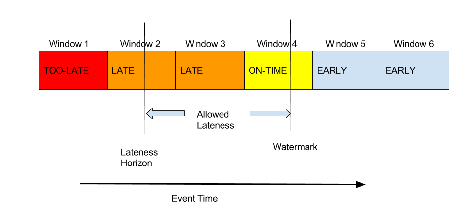

# WINDOWED OPERATOR

## Introduction

The `WindowedOperator` is an operator in the Apex Malhar Library that supports the windowing semantics outlined by Apache Beam, including the notions of watermarks, triggers, accumulation modes, and allowed lateness. It currently supports event time windows, sliding event time windows, session windows, and global window. The reader of this document is encouraged to read this [blog](https://www.oreilly.com/ideas/the-world-beyond-batch-streaming-102) first for the basic knowledge of Apache Beam's windowing semantics before using this operator.

Our High-Level API supports event-time processing through the WindowedOperator. If you'd like to process tuples based on event time, you are encouraged to use this operator either directly with our DAG-level API, or indirectly through our High-Level API.

It is important to note that the word "windows" in this document is unrelated to "streaming windows" or "application windows" in Apex. 

## Operator Overview

In this document, we will explore the following features in the WindowedOperator.

1. Keyed or Not Keyed
2. Window Option
3. Timestamp Extractor
4. Watermarks
5. Allowed Lateness
6. Accumulation
7. Triggers
8. Accumulation Mode
9. Window Propagation
10. Merging two streams

## Keyed or Not Keyed

One of the first thing the user of the operator has to decide is whether the operator is keyed ([KeyedWindowedOperatorImpl](https://github.com/apache/apex-malhar/blob/master/library/src/main/java/org/apache/apex/malhar/lib/window/impl/KeyedWindowedOperatorImpl.java)) or not keyed ([WindowedOperatorImpl](https://github.com/apache/apex-malhar/blob/master/library/src/main/java/org/apache/apex/malhar/lib/window/impl/WindowedOperatorImpl.java)). Accumulation and triggers behave differently based on whether or not the operator is keyed.
We will cover the concepts of [accumulation](#accumulation) and [triggers](#triggers) later in the document.

## Window Option

Each incoming tuple of the WindowedOperator is assigned to one or more windows. The `WindowOption` provides the way to specify what constitutes a window. The following `WindowOption`s are supported.

### `GlobalWindow`

There is only one window for the entire duration of the application. All tuples are assigned to this one window.

### `TimeWindows`

 

A tuple is assigned to exactly one window based on event time, and each window has a fixed duration. One window is followed immediately by another window, and they do not overlap. As a result, one timestamp can only belong to one window.

### `SlidingTimeWindows`

 

Similar to `TimeWindow`, each window has a fixed duration. But it takes an additional duration parameter  `slideBy` which must be smaller than the window duration and the window duration must be divisible by the `slideBy` duration. Each window overlaps with multiple windows. In this case, since one timestamp belongs multiple windows, a tuple is assigned to multiple windows. The number of windows a tuple belongs to is exactly the window duration divided by the `slideBy` duration.

### `SessionWindows`

`SessionWindow`s have variable durations and are based on the key of the tuple, and each tuple is assigned to exactly one window. It takes a duration parameter `minGap`, which specifies the minimum time gap between two `SessionWindow`s of the same key. To ensure that no two `SessionWindow`s of the same key are less than `minGap` apart, upon an arrival of a tuple, the `WindowedOperator` does the following checks:
  
#### The arrival of the new tuple would result in a merge of the two existing session windows

 

A new Session Window is created with the merged state of the two existing `SessionWindow`s of the same key, plus the new tuple. The two existing `SessionWindow`s will be deleted and retraction triggers for the two deleted windows will be fired. (Please see here for details on `Trigger`s)

#### The arrival of the new tuple would result in an extension of an existing session windows

 

A new `SessionWindow` is created with the state of the existing `SessionWindow`, plus the new tuple, with a longer duration than the existing `SessionWindow` to cover the new tuple. The existing `SessionWindow` will be deleted and a retraction trigger for the old window will be fired.

#### The new tuple can safely be assigned to an existing session window without change

 

The new tuple is simply applied to the state of the existing session window. 

If all of the above checks return false, then a new `SessionWindow` is created for the new tuple.

## Timestamp Extractor

The `WindowedOperator` expects a timestamp extractor. This is for `WindowedOperator` to extract the timestamp from the tuple for window assignment.

## Watermarks

Watermarks are control tuples that includes a timestamp. It basically tells `WindowedOperator` that all windows that lie completely before the given timestamp are considered late, and the rest of the windows are considered early. 

### Fixed Watermark

If watermarks are not available from upstream, the user of the WindowedOperator can set a fixed watermark. The fixed watermark represents the number of milliseconds before the timestamp derived from the Apex streaming window ID. Note that the Apex streaming window ID has an implicit timestamp that more or less represents the ingression time of the tuple.

## Allowed Lateness

 

Allowed Lateness specifies the lateness horizon from the watermark. If a tuple has a timestamp that lies beyond the lateness horizon, it is dropped by the `WindowedOperator`. Also, if a window completely lies beyond the lateness horizon, the window along with its state is purged from `WindowedOperator`.

## Accumulation

The Accumulation object tells the WindowedOperator how the operator state is accumulated. It tells the `WindowedOperator` what to do with its state upon arrival of an incoming tuple. This is where the business logic goes. Please refer to the interface definition [here](https://github.com/apache/apex-malhar/blob/master/library/src/main/java/org/apache/apex/malhar/lib/window/Accumulation.java) in github. For non-keyed WindowedOperator, the state is per window. For keyed WindowedOperator, the state is per key per window.

The user of this operator can use one of the existing accumulation implementations [here](https://github.com/apache/apex-malhar/tree/master/library/src/main/java/org/apache/apex/malhar/lib/window/accumulation), or provides their own custom accumulation that reflects their business logic. 

## Triggers

Triggers are tuples emitted to downstream by the `WindowedOperator`. The data in the tuples are based on the state of `WindowedOperator` governed by the Accumulation object. There are two types of trigger: time-based triggers and count-based triggers. Time-based triggers are triggers that get fired in a regular time interval, and count-based triggers are triggers that get fired based on the number of tuples received. The user of WindowedOperator can specify different triggers for windows that are early or late based on the watermark.

Also, by default, a trigger is fired for a window when the window is flipped from being early to being late. This is also called an "on-time" trigger.

Note that for non-keyed `WindowedOperator`, triggers are fired on a per-window basis. For keyed `WindowedOperator`, triggers are fired on a per-key-per-window basis.

There is also an option the user can set (`fireOnlyUpdatedPanes`) to make the `WindowedOperator` not fire a trigger if the trigger value is the same as the value of the previous trigger. 

## Accumulation Mode

There are three supported accumulation mode: `ACCUMULATING`, `DISCARDING`, and `ACCUMULATING_AND_DISCARDING`.

* `ACCUMULATING`: The state of the window is preserved until purged
* `DISCARDING`: The state of the window is discarded after firing of a trigger
* `ACCUMULATING_AND_RETRACTING`: The state of the window is preserved until purged, but if the state has changed upon a trigger compared to the previous trigger, an additional retraction trigger is fired.

## Window Propagation

It is possible to chain multiple instances of `WindowedOperator` and have only the most upstream instance assign the windows and have all downstream instances inherit the same windows of the triggers from the upstream instance. If WindowOption is `null` (i.e. setWindowOption is not called), the `WindowedOperator` assumes that the incoming tuples are `WindowedTuple`s that contain the information of the window assignment for each tuple.

## State Storage

The `WindowedOperator` currently supports two different state storage mechanisms.
 
[In-Memory Windowed Storage](https://github.com/apache/apex-malhar/blob/master/library/src/main/java/org/apache/apex/malhar/lib/window/impl/InMemoryWindowedStorage.java) stores the operator state only in memory and the entire state is copied to DFS at checkpoint. This storage is useful if the state is expected to be small and the cardinality of valid windows and keys are small.

[Spillable Windowed Storage](https://github.com/apache/apex-malhar/blob/master/library/src/main/java/org/apache/apex/malhar/lib/window/impl/SpillableWindowedPlainStorage.java) stores the operator state in DFS with a cache in memory. This storage mechanism handles large states and incremental checkpointing. 

## Merging two streams

The `MergeWindowedOperator` is a `WindowedOperator` that takes two incoming data streams. It takes a [`MergeAccumulation`](https://github.com/apache/apex-malhar/blob/master/library/src/main/java/org/apache/apex/malhar/lib/window/MergeAccumulation.java) instead of a regular Accumulation. The user of this operator can implement their custom merge or join accumulation based on their business logic. 

The `MergeWindowedOperator` has its own watermark. Its own watermark is earlier watermark timestamp between the two input streams. When that value changes, a separate watermark is fired to downstream.

